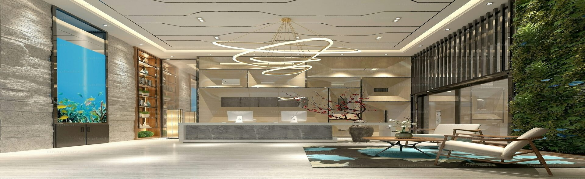

# Vinh Long Hotel

## Thông tin liên lạc
- Email: phamminhman719@gmail.com
- Điện thoại: 0823521928

## Mô tả dự án + mục tiêu
Dự án xây dựng hệ thống đặt phòng khách sạn trực tuyến cho Vinh Long Hotel.
Mục tiêu là cung cấp trải nghiệm đặt phòng nhanh chóng, quản lý thông tin phòng,
đặt phòng, thanh toán và quản trị nội dung cơ bản cho người dùng và quản trị viên.

## Công nghệ sử dụng
- PHP, HTML, CSS, JavaScript
- MySQL (XAMPP)
- Bootstrap 5, Swiper

## Chức năng chính
- Tra cứu phòng, xem chi tiết phòng
- Đặt phòng, xác nhận đặt phòng, lịch sử đặt phòng
- Quản lý thông tin khách hàng (đăng nhập/đăng ký)
- Quản trị nội dung cơ bản (phòng, tiện ích, điểm đến)

## Yêu cầu hệ thống
- PHP 8.x
- MySQL/MariaDB
- XAMPP (khuyến nghị)
- Trình duyệt hiện đại (Chrome/Edge/Firefox)

## Hướng dẫn cài đặt chi tiết
1. Cài XAMPP và bật Apache + MySQL.
2. Copy project vào `C:\xampp\htdocs\vinhlong_hotel`.
3. Tạo database và import file trong thư mục `database/` (ví dụ `vinhlong_hotel.sql`).
4. Truy cập `http://localhost/vinhlong_hotel`.

## Tài khoản demo
- User: (tự đăng ký tài khoản)
- Admin (nếu có):
  - Tài khoản: Man
  - Mật khẩu: 123123

## Cấu trúc thư mục (chi tiết)
```
vinhlong_hotel/
├─ admin/                 # khu vực quản trị
│  ├─ ajax/               # xử lý AJAX cho admin
│  ├─ inc/                # cấu hình + hàm dùng chung
│  ├─ modals/             # modal giao diện
│  ├─ vendor/             # thư viện PHP (composer)
│  └─ ...
├─ ajax/                  # xử lý AJAX phía user
├─ css/                   # stylesheet
├─ database/              # file SQL (import DB)
├─ fonts/                 # font các bộ
├─ images/                # ảnh giao diện
│  ├─ about/              # ảnh giới thiệu
│  ├─ app/                # badge App Store/Google Play
│  ├─ carousel/           # ảnh slider trang chủ
│  ├─ destinations/       # ảnh điểm đến
│  ├─ facilities/         # ảnh tiện ích
│  ├─ rooms/              # ảnh phòng
│  └─ ...
├─ inc/                   # header, footer, links, modal, i18n
├─ js/                    # script giao diện
├─ lib/                   # thư viện tích hợp
├─ logo/                  # logo dự án
├─ owner/                 # khu vực dành cho chủ khách sạn
├─ about.php
├─ bookings.php
├─ confirm_booking.php
├─ index.php
├─ rooms.php
└─ README.md
```

## Cấu trúc thư mục theo yêu cầu nộp đồ án
```
setup/            # file cài đặt, dữ liệu mẫu, hướng dẫn triển khai
scr/              # mã nguồn và dữ liệu thử nghiệm
progress-report/  # báo cáo tiến độ (bắt buộc)
thesis/           # tài liệu đồ án (bắt buộc)
  ├─ doc/
  ├─ pdf/
  ├─ html/
  ├─ abs/
  ├─ refs/
  ├─ soft/         # nếu có
  └─ docker/       # nếu có
```

## Hình ảnh
Logo:


Ảnh carousel mẫu:


Ảnh giới thiệu:

